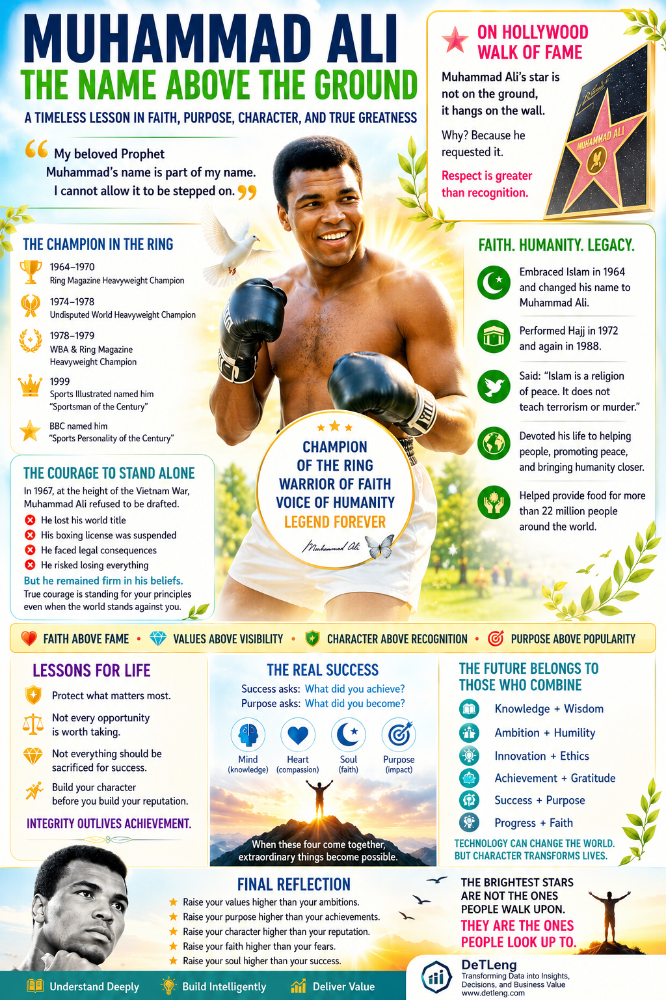

# 🥊☪️ Muhammad Ali: The Name Above the Ground

# 🥊Faith • Purpose • Legacy • Character

  ## A BBC Urdu Story of Faith, Courage, Purpose, and Spiritual Dignity

  

> 📖 Original Urdu Article (BBC Urdu)
>
> https://www.bbc.com/urdu/articles/cx2dlmg1zlvo

---

# 🌟 MUHAMMAD ALI 🌟

### 🥊 Champion of the Ring
### ☪️ Defender of Faith
### 🌍 Voice of Humanity
### 🕊️ Symbol of Dignity

---

## 💭 A World Obsessed with Fame

We live in a world where people chase:

- 💰 **Wealth**
- 🏆 **Titles**
- 📈 **Success**
- 🌟 **Recognition**
- 👑 **Status**

Yet very few people achieve something greater:

# ✨ Respect

And even fewer achieve:

# 🌍 Legacy

Muhammad Ali achieved both.

Not simply because he became one of the greatest boxers of all time.

But because he chose to stand for something greater than himself.

---

## 🥊 More Than a Champion

Millions remember Muhammad Ali for:

✅ His speed

✅ His confidence

✅ His courage

✅ His unforgettable personality

✅ His legendary victories

Yet his greatest battles were never fought inside a boxing ring.

They were fought within his conscience.

---

## ⚖️ The Courage to Stand Alone

When asked to participate in a war that conflicted with his beliefs, Muhammad Ali refused.

As a result:

❌ His world title was taken away

❌ His boxing license was suspended

❌ He faced legal consequences

❌ He risked losing everything

Yet he remained firm.

Because true courage is not the absence of fear.

It is the willingness to stand for your principles even when the world stands against you.

---

# ☪️ The Name He Refused to Let People Walk On

Among thousands of stars on Hollywood's famous Walk of Fame, there is one star unlike all others.

⭐ **Muhammad Ali's star is not placed on the ground.**

It hangs on a wall.

Why?

Because he requested it.

His reason was simple and deeply spiritual:

> **"My beloved Prophet Muhammad's name is part of my name. I cannot allow it to be stepped on."**

---

## 🌟 A Lesson Greater Than Fame

Most people dream of having their name displayed in Hollywood.

Muhammad Ali cared more about honoring a sacred name than receiving public recognition.

That decision teaches us:

### ✨ Faith Above Fame

### ✨ Values Above Visibility

### ✨ Character Above Recognition

### ✨ Purpose Above Popularity

---

# 🧠 Building Character in the Modern World

Modern society teaches us:

📱 Build a personal brand.

📈 Increase your followers.

🎯 Gain more visibility.

💼 Become successful.

Muhammad Ali teaches something different:

> **Build your character before you build your reputation.**

Because reputation is what people think about you.

Character is who you truly are.

---

# 🚀 Success Is Not the Destination

Many people become successful.

Few become meaningful.

Many accumulate wealth.

Few create impact.

Many chase opportunities.

Few discover purpose.

---

## 🌍 The Real Question

Success asks:

> **What did you achieve?**

Purpose asks:

> **What did you become?**

That is the difference between a successful life and a significant life.

---

# 💡 Lessons for Leaders, Builders, and Dreamers

Whether you are:

- 👨‍💻 Engineer
- 📊 Data Professional
- 💼 Entrepreneur
- 🎓 Student
- 📈 Business Leader
- 🌍 Creator

Muhammad Ali's story offers a powerful lesson:

# ✨ Protect What Matters Most

Not everything should be sacrificed for success.

Not every opportunity should be accepted.

Not every shortcut should be taken.

Not every reward is worth compromising your values.

---

# 🌅 The Future Belongs to Those Who Combine

## 🧠 Knowledge + Wisdom

## 🚀 Ambition + Humility

## 💡 Innovation + Ethics

## 📈 Achievement + Gratitude

## 🌍 Success + Purpose

## ☪️ Progress + Faith

---

# 🤖 The Age of Technology

We live in an era of:

- Artificial Intelligence
- Data Engineering
- Cloud Computing
- Automation
- Analytics
- Global Connectivity

Technology can transform industries.

But character transforms lives.

Data creates insights.

Wisdom creates direction.

Knowledge creates power.

Values create greatness.

---

# ✨ A Message for the Next Generation

The future belongs to people who can combine:

🚀 Innovation

🧠 Intelligence

❤️ Humanity

🕊️ Spirituality

🌍 Responsibility

People who know how to build technology **without losing their values**.

People who know how to achieve success **without losing their soul**.

---

# 🌟 The Brightest Stars

Most stars are placed on the ground.

People walk over them.

People forget them.

People move on.

Muhammad Ali's star was placed above.

People look up.

People admire.

People remember.

People reflect.

Perhaps that is the greatest lesson of all.

---

# 🕊️ Final Reflection

> **Raise your values higher than your ambitions.**
>
> **Raise your purpose higher than your achievements.**
>
> **Raise your character higher than your reputation.**
>
> **Raise your faith higher than your fears.**
>
> **Raise your soul higher than your success.**

Because the brightest stars are not the ones people walk upon.

# ✨ They are the ones people look up to.

---

## 🌍 DeTLeng

### Data Engineering • Analytics • Reporting Automation • Business Intelligence

**Transforming Data into Insights, Decisions, and Business Value**

🌐 https://www.detleng.com/

---

### 🧠 Understand Deeply

### 🚀 Build Intelligently

### 🌟 Deliver Value

---

> *Inspired by the life, principles, courage, faith, and spiritual dignity of Muhammad Ali — a champion remembered not only for how he fought, but for what he stood for.*

🕊️
