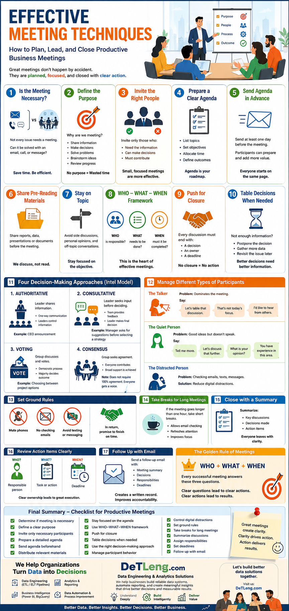

# Effective Meeting Techniques: How to Plan, Lead, and Close Productive Business Meetings

---

# 1. INTRODUCTION TO EFFECTIVE MEETINGS

Meetings are a critical part of business communication. Whether participants are:

* Physically present in a room
* Joining remotely through phone or video conference

The same principles of effective meeting management apply.

A successful meeting requires:

* Clear planning
* Strong facilitation
* Focused discussion
* Defined outcomes
* Effective follow-up

---

# 2. CREATING A POSITIVE MEETING ENVIRONMENT

Before discussing business matters, create a welcoming atmosphere.

### Examples:

* Greeting attendees warmly
* Providing refreshments (coffee, snacks, etc.)
* Making participants feel comfortable

Benefits:

* Builds rapport
* Encourages participation
* Creates a positive meeting experience

---

# 3. DETERMINE WHETHER A MEETING IS NECESSARY

## First Question:

### "Is this meeting really necessary?"

Many meetings are scheduled unnecessarily.

Sometimes a:

* Phone call
* Email
* Instant message

can solve the issue more efficiently.

### Best Practice

Before scheduling a meeting, ask:

* Can this be handled by email?
* Can this be solved with a quick call?
* Is face-to-face discussion truly needed?

---

# 4. DEFINE THE PURPOSE OF THE MEETING

One of the biggest mistakes in business is holding meetings without a clear objective.

Every meeting must answer:

### Why are we meeting?

Examples:

* Share information
* Make decisions
* Solve problems
* Brainstorm ideas
* Review progress

Without a clear purpose:

* Discussions become unfocused
* Time is wasted
* Decisions are delayed

---

# 5. SELECT THE RIGHT PARTICIPANTS

Employees are busy.

Only invite people who:

* Need the information
* Have decision-making authority
* Must contribute to the discussion

### Avoid:

* Inviting unnecessary attendees
* Oversized meetings

### Remember:

Several short meetings are often more effective than one long meeting.

---

# 6. PREPARE A DETAILED AGENDA

An agenda acts as the roadmap for the meeting.

A good agenda should include:

* Topics to discuss
* Objectives
* Time allocations
* Expected outcomes

---

# 7. SEND THE AGENDA IN ADVANCE

Best practice:

Send the agenda before the meeting (preferably one day earlier).

### Benefits:

Participants can:

* Prepare ideas
* Gather information
* Review documents
* Understand expectations

Everyone starts the meeting on the same page.

---

# 8. DISTRIBUTE PRE-READING MATERIALS

If participants need information beforehand:

Send:

* Reports
* Presentations
* Data
* Documents

before the meeting.

This prevents wasting meeting time reviewing basic information.

---

# 9. STICK TO THE AGENDA

One of the most difficult responsibilities of a facilitator is keeping discussions on track.

Common distractions include:

* Personal opinions
* Pet projects
* Side conversations
* Excessive details
* Off-topic discussions

### Goal:

Stay focused on the meeting objective.

---

# 10. THE WHO–WHAT–WHEN FRAMEWORK

The most important meeting principle:

## WHO?

Who is responsible?

## WHAT?

What action needs to be completed?

## WHEN?

When must it be completed?

---

### Effective meetings always produce:

* Clear ownership
* Clear actions
* Clear deadlines

---

# 11. PUSH FOR CLOSURE

Many meetings end with discussion but no decisions.

A facilitator must push for closure by identifying:

* Who will do it?
* What will be done?
* When will it be completed?

Without closure:

* Nothing gets accomplished
* Accountability disappears

---

# 12. TABLE DECISIONS WHEN NECESSARY

Sometimes enough information is not available.

In such situations:

* Postpone the decision
* Gather more information
* Revisit the issue later

Avoid forcing decisions without sufficient data.

---

# 13. FOUR DECISION-MAKING APPROACHES (INTEL MODEL)

Intel uses four meeting approaches to clarify meeting purpose.

---

## A. AUTHORITATIVE APPROACH

### Purpose:

Leadership shares information.

### Characteristics:

* One-way communication
* Leaders control information
* Employees mainly listen

Example:

CEO announcement.

---

## B. CONSULTATIVE APPROACH

### Purpose:

Leader seeks input before making a decision.

### Characteristics:

* Team provides feedback
* Leader makes final decision

Example:

Manager asks employees for suggestions before selecting a strategy.

---

## C. VOTING APPROACH

### Purpose:

Group discusses an issue and votes.

### Characteristics:

* Democratic process
* Majority decides outcome

Example:

Choosing between project options.

---

## D. CONSENSUS APPROACH

### Purpose:

Reach agreement among participants.

### Characteristics:

* Everyone contributes
* Broad support is achieved

Important:

Consensus does not require 100% agreement.

It requires that everyone has an opportunity to express their views.

---

# 14. BENEFITS OF DECISION-MAKING CLARITY

When participants know the meeting type:

They understand:

* Purpose
* Expectations
* Desired outcomes

Result:

More productive meetings.

---

# 15. MANAGING DIFFERENT TYPES OF PARTICIPANTS

A facilitator must control meeting dynamics.

---

## A. Conversation Monopolizers

People who dominate discussions.

Problem:

Others do not get a chance to speak.

Useful phrases:

* "Let's table that discussion until later."
* "That's not today's focus."
* "I'd like to hear from others now."

---

## B. Silent Participants

People with good ideas who rarely speak.

Problem:

Valuable insights are lost.

Useful phrases:

* "Tell me more."
* "Let's discuss that further."
* "What is your opinion?"
* "You have experience in this area."

---

## C. Distracted Participants

People checking:

* Emails
* Text messages
* Instant messages

Problem:

Reduced engagement and slower meetings.

---

# 16. REDUCING DIGITAL DISTRACTIONS

Many attendees feel tempted to check messages during meetings.

To maintain focus:

### Establish Ground Rules

Ask participants to:

* Mute phones
* Avoid checking emails
* Avoid texting

In return:

Promise to finish on time.

---

# 17. USE BREAKS FOR LONG MEETINGS

For meetings longer than one hour:

Provide short breaks.

Benefits:

* Allows email checking
* Refreshes attention
* Improves concentration

---

# 18. CLOSE WITH A SUMMARY

Never end a meeting abruptly.

Summarize:

* Key discussions
* Decisions made
* Action items

This ensures everyone leaves with the same understanding.

---

# 19. REVIEW ACTION ITEMS

Clearly identify:

### Who?

Responsible person

### What?

Assigned task

### When?

Deadline

This reinforces accountability.

---

# 20. FOLLOW UP WITH EMAIL

After the meeting:

Send a follow-up email containing:

* Meeting summary
* Decisions made
* Responsibilities assigned
* Deadlines

Benefits:

* Creates a written record
* Prevents misunderstandings
* Improves accountability

---

# KEY PHRASES FOR MEETING FACILITATORS

### Controlling Discussion

* Let's table that discussion until later.
* That's not the focus of today's meeting.
* I'd like to hear from others.

### Encouraging Participation

* That's an interesting point.
* Tell me more.
* Let's discuss that further.
* What is your opinion?
* You have experience in this area.

---

# GOLDEN RULE OF EFFECTIVE MEETINGS

## WHO + WHAT + WHEN

Every successful meeting should clearly answer:

### WHO is responsible?

### WHAT must be done?

### WHEN must it be completed?

If these three questions are answered, the meeting has achieved its purpose.

---

# FINAL SUMMARY

### Effective meetings require:

✅ Determine if the meeting is necessary

✅ Define a clear purpose

✅ Invite only necessary participants

✅ Prepare a detailed agenda

✅ Send agenda beforehand

✅ Distribute relevant materials

✅ Stay focused on the agenda

✅ Push for closure

✅ Use the Who–What–When framework

✅ Manage participation effectively

✅ Control distractions

✅ Establish meeting ground rules

✅ Provide breaks for long meetings

✅ Summarize discussions

✅ Assign responsibilities

✅ Set deadlines

✅ Follow up with email

## Key Principle

> **An effective meeting is not measured by how much discussion takes place, but by how clearly responsibilities, actions, and deadlines are defined.**

---

## About These Notes

These study notes have been compiled and organized by **DeTLeng** to simplify learning and support professional development. The material is based on widely recognized management, leadership, and business communication concepts, presented in a structured format for educational and reference purposes.

The material is based on widely accepted concepts and best practices in **Management, Leadership, Business Communication, Team Collaboration, and Workplace Effectiveness** that are commonly taught in professional training programs, leadership courses, and business education.

The purpose of these notes is to:

* Simplify complex concepts
* Improve understanding and retention
* Support students and professionals in their learning journey
* Provide a structured reference for revision and self-study
* Transform theoretical knowledge into practical workplace skills

---

## Educational Note

This article provides a structured summary of commonly accepted management, leadership, and business communication concepts for educational and professional development purposes. It is intended as a learning resource and does not represent an official publication of any specific course or training program.

---

## Learning Objectives

After studying these notes, readers should be able to:

✅ Plan productive meetings

✅ Create effective meeting agendas

✅ Facilitate focused discussions

✅ Encourage participation from team members

✅ Manage difficult meeting situations

✅ Improve decision-making processes

✅ Assign responsibilities effectively

✅ Conduct professional follow-up communication

---

## Recommended Audience

These notes are especially useful for:

* Managers
* Team Leaders
* Supervisors
* Business Professionals
* Entrepreneurs
* Project Managers
* Students of Management and Leadership
* Professionals preparing for workplace communication roles

---

## Final Thoughts

Effective meetings are not measured by the amount of discussion that takes place, but by the quality of decisions, accountability, and actions that follow.

Successful leaders understand that every meeting should have a clear purpose, focused discussion, defined responsibilities, and measurable outcomes. By applying the techniques discussed in these notes, professionals can improve collaboration, increase productivity, and ensure that meetings contribute real value to their organizations.

Remember the simple framework:

**Who is responsible?**

**What needs to be done?**

**When must it be completed?**

When these three questions are answered clearly, meetings become more effective, decisions become stronger, and teams perform better.

---

## About DeTLeng

At DeTLeng, we believe that continuous learning, clear communication, and structured problem-solving are essential skills for professional success.

While our primary focus is helping organizations build reliable Data Engineering, Analytics, Reporting, and Business Intelligence solutions, we also value the leadership, communication, and decision-making skills that enable teams and businesses to perform at their best.

---

## Learn More About Data Engineering & Analytics

Organizations today need more than data—they need reliable systems that transform information into meaningful business outcomes.

DeTLeng helps organizations build:

- ETL & ELT Pipelines
- Reporting Automation Solutions
- Power BI Dashboards
- Google BigQuery Analytics
- Business Intelligence Platforms
- Data Quality & Governance Solutions

Our goal is simple:

**Transform complex data into clear business value.**

---

## Why DeTLeng?

✓ Understand Deeply

✓ Build Intelligently

✓ Deliver Value

✓ Focus on Business Outcomes

✓ Create Measurable Impact

---

### DeTLeng
*Data Engineering & Analytics Solutions*

🌐 **https://www.detleng.com**

**Understand Deeply. Build Intelligently. Deliver Value.**

---
